# the scraper

## low level design

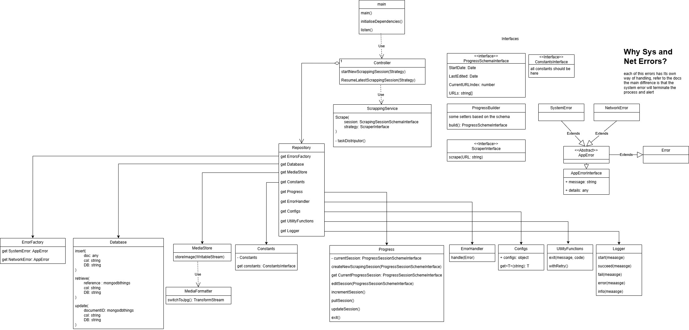

**Break throgh**

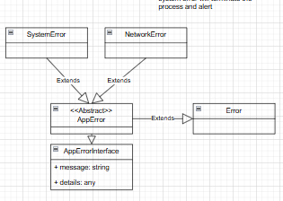

### the difference between system error and network error

system error terminates the process, it is thrown when a dependency is missing or a system component is failure

network error is retriable and meant for scraping failures and so and doesnt terminate the process

also any error that is not an instance of app error will terminate the process

### interfaces

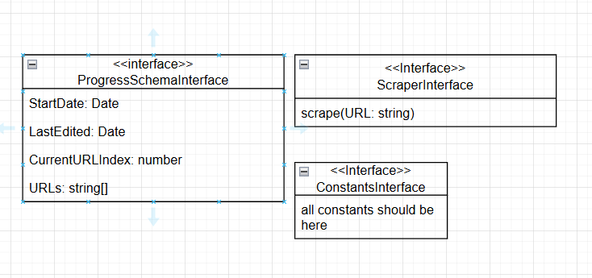

these are the main interfaces in the app

### How the app works

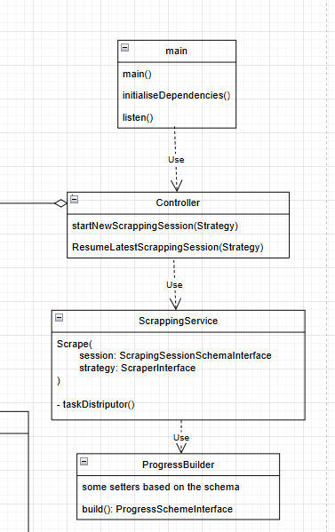

this is simple how it will work, i separated task management from actual implementation to be able to carry on different types of websites

### the repository

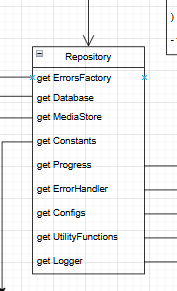

this class provides the implementation of services that the scrapper is supposed to use

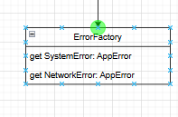

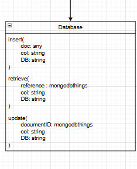

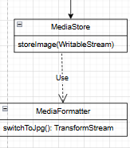

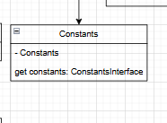

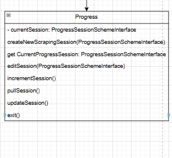

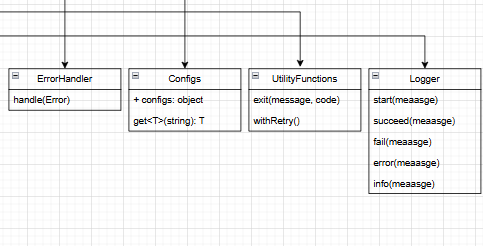

### details

#### strategies namespace

useful to register strategies

```ts
export namespace StrategiesNameSpace {
    export const condonow = 'condonow';
}
```

```ts
import { StrategiesNameSpace } from '../interfaces/strategies.namespace';

export class Controller {
    constructor() {}

    public startNewScrapingSession(
        strategyName: keyof typeof StrategiesNameSpace,
    ): void {}
}
```

the controller needs these namespace fields to use them
